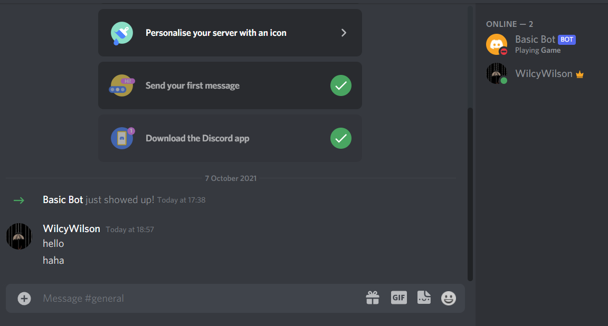
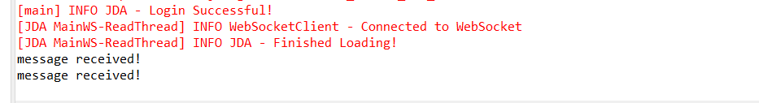
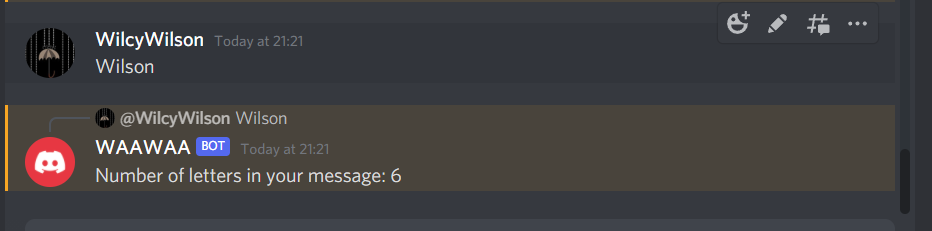

### Event Handling 

- Like bot reacting to a user message.
- Authorize your bot in Discord with Client ID.
*https://discordapp.com/oauth2/authorize?&client_id=[CLIENTID]&scope=bot*

### Here below we receive the output whenever a message is sent to the server

#### Discord

#### Program Output

#### Message count
