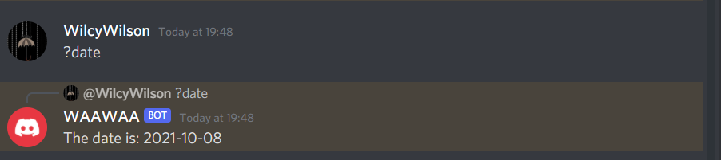
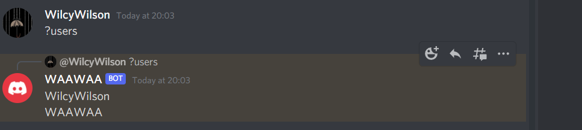

### Event Handling 

- Adding command so that bot can reply to specific command
- ?date will reply with a date
- ?users will reply with all the users in the server

### Here below we receive the output whenever a message is sent to the server

#### Date

#### Users

